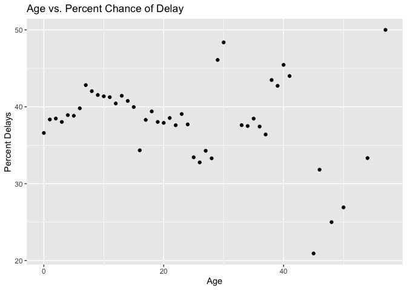

HW3
================

All code can be found within the [GitHub
link](https://github.com/lilyfranks/Homework3-Stat433)

``` r
library(dplyr)
library(nycflights13)
library(ggplot2)
library(tidyr)
library(maps)
```

Question 1: Compute the average delay by destination, then join on the
airports data frame so you can show the spatial distribution of delays.

``` r
q1 = flights %>%
  group_by(dest) %>%
  summarise(avgdel = mean(arr_delay, na.rm = TRUE)) %>%
  left_join(airports, c("dest" = "faa")) 

q1
```

    ## # A tibble: 105 x 9
    ##    dest  avgdel name                    lat    lon   alt    tz dst   tzone      
    ##    <chr>  <dbl> <chr>                 <dbl>  <dbl> <dbl> <dbl> <chr> <chr>      
    ##  1 ABQ     4.38 Albuquerque Internat…  35.0 -107.   5355    -7 A     America/De…
    ##  2 ACK     4.85 Nantucket Mem          41.3  -70.1    48    -5 A     America/Ne…
    ##  3 ALB    14.4  Albany Intl            42.7  -73.8   285    -5 A     America/Ne…
    ##  4 ANC    -2.5  Ted Stevens Anchorag…  61.2 -150.    152    -9 A     America/An…
    ##  5 ATL    11.3  Hartsfield Jackson A…  33.6  -84.4  1026    -5 A     America/Ne…
    ##  6 AUS     6.02 Austin Bergstrom Intl  30.2  -97.7   542    -6 A     America/Ch…
    ##  7 AVL     8.00 Asheville Regional A…  35.4  -82.5  2165    -5 A     America/Ne…
    ##  8 BDL     7.05 Bradley Intl           41.9  -72.7   173    -5 A     America/Ne…
    ##  9 BGR     8.03 Bangor Intl            44.8  -68.8   192    -5 A     America/Ne…
    ## 10 BHM    16.9  Birmingham Intl        33.6  -86.8   644    -6 A     America/Ch…
    ## # … with 95 more rows

``` r
ggplot(q1, aes(lon, lat)) +
  borders("state") +
  geom_point(aes(color = avgdel)) +
  coord_quickmap()
```

<!-- -->

Question 2: Add the location of the origin and destination (i.e. the lat
and lon) to flights.

``` r
orig_air = airports %>%
  group_by(faa) %>%
  summarise(orig_lat = lat, orig_lon = lon)

#orig_air

dest_air = airports %>%
  group_by(faa) %>%
  summarise(dest_lat = lat, dest_lon = lon)

#dest_air
```

``` r
flights %>%
  select(year, hour, origin, dest) %>%
  left_join(orig_air, c("origin" = "faa")) %>%
  left_join(dest_air, c("dest" = "faa"))
```

    ## # A tibble: 336,776 x 8
    ##     year  hour origin dest  orig_lat orig_lon dest_lat dest_lon
    ##    <int> <dbl> <chr>  <chr>    <dbl>    <dbl>    <dbl>    <dbl>
    ##  1  2013     5 EWR    IAH       40.7    -74.2     30.0    -95.3
    ##  2  2013     5 LGA    IAH       40.8    -73.9     30.0    -95.3
    ##  3  2013     5 JFK    MIA       40.6    -73.8     25.8    -80.3
    ##  4  2013     5 JFK    BQN       40.6    -73.8     NA       NA  
    ##  5  2013     6 LGA    ATL       40.8    -73.9     33.6    -84.4
    ##  6  2013     5 EWR    ORD       40.7    -74.2     42.0    -87.9
    ##  7  2013     6 EWR    FLL       40.7    -74.2     26.1    -80.2
    ##  8  2013     6 LGA    IAD       40.8    -73.9     38.9    -77.5
    ##  9  2013     6 JFK    MCO       40.6    -73.8     28.4    -81.3
    ## 10  2013     6 LGA    ORD       40.8    -73.9     42.0    -87.9
    ## # … with 336,766 more rows

Question 3: Is there a relationship between the age of a plane and its
delays?

``` r
q3 = planes %>%
  summarise(tailnum, year1 = year) %>%
  left_join(flights, "tailnum") %>%
  mutate(delay = case_when(arr_delay > 0 ~ 1, TRUE ~ 0), age = (year - year1)) %>%
  select(age, dep_delay, arr_delay, delay)

q3
```

    ## # A tibble: 284,170 x 4
    ##      age dep_delay arr_delay delay
    ##    <int>     <dbl>     <dbl> <dbl>
    ##  1     9        -4         2     1
    ##  2     9        48        40     1
    ##  3     9        39        47     1
    ##  4     9        -2       -12     0
    ##  5     9        -4        -8     0
    ##  6     9        26        27     1
    ##  7     9        -8       -20     0
    ##  8     9        11        -5     0
    ##  9     9        15        20     1
    ## 10     9       102       123     1
    ## # … with 284,160 more rows

``` r
q3_1 = q3 %>%
  group_by(age) %>%
  summarise(perc_del = round((mean(delay) * 100), 2),
            total_depdel = sum(!is.na(dep_delay)), 
            total_arrdel = sum(!is.na(arr_delay)),
            avg_depdelay = mean(dep_delay, na.rm = TRUE),
            avg_arrdelay = mean(arr_delay, na.rm = TRUE))

q3_1
```

    ## # A tibble: 47 x 6
    ##      age perc_del total_depdel total_arrdel avg_depdelay avg_arrdelay
    ##    <int>    <dbl>        <int>        <int>        <dbl>        <dbl>
    ##  1     0     36.6         4621         4611        10.6          4.01
    ##  2     1     38.4         7214         7196         9.64         2.85
    ##  3     2     38.5         6017         6008        11.8          5.70
    ##  4     3     38.0         3777         3771        12.5          5.18
    ##  5     4     38.9         6584         6572        11.0          4.92
    ##  6     5     38.8        17809        17731        13.2          5.57
    ##  7     6     39.8        15207        15142        13.7          7.54
    ##  8     7     42.8        13030        12998        14.6          9.90
    ##  9     8     42.0        14112        14064        14.7          9.80
    ## 10     9     41.5        15339        15273        16.4         10.2 
    ## # … with 37 more rows

Let’s take a look at the percent chance of delays per age of the plane.

``` r
ggplot(q3_1, aes(age, perc_del)) +
  geom_point() +
  ggtitle("Age vs. Percent Chance of Delay") +
  xlab("Age") +
  ylab("Percent Delays")
```

<!-- -->
<!-- -->
**Response:** In the first graph, we can observe that planes between the
ages 0-20 years old tend to have around a 40% chance of being delayed,
and from ages 20-30 around a 30-39% chance. Planes aged 30-60 years old
do not show a pattern of percent chance delays and therefore do not
exhibit a relationship. Looking at the second graph, this is mostly
likely due to the fact that there are minimal flights in the data with
planes aged 30 years old and up, compared to the numerous recorded for
planes aged 0-30.

Hence, we can observe there is no strong relationship between age and
percent chances of delays, but we can observe that on average, planes
aged 0-30 exhibit approximately a 30-40% chance of delay. With more data
on planes aged 30 and up, we could have a better idea of what kind of
relationship age and delays have.

Now, let’s look at how age affects the average departure and air delay.

``` r
ggplot(q3_1, aes(age, avg_depdelay)) +
  geom_line() +
  ggtitle("Age vs. Average Departure Delay") +
  xlab("Age") +
  ylab("Average Departure Delay (Minutes)")
```

<!-- -->

``` r
ggplot(q3_1, aes(age, avg_arrdelay)) +
  geom_line() +
  ggtitle("Age vs. Average Arrival Delay") +
  xlab("Age") +
  ylab("Average Arrival Delay (Minutes)")
```

<!-- -->
**Response:** We observe that there is a minimal relationship between
the age of plane and the departure/arrival delay time of a flight.
However, once again we see that there is a more steady line decrease for
planes aged 0-30 before major spikes happen with ages 30 and up.
Additionally, it is very interesting that departure and arrival delay
relationships with the age of a plane are very similar.
